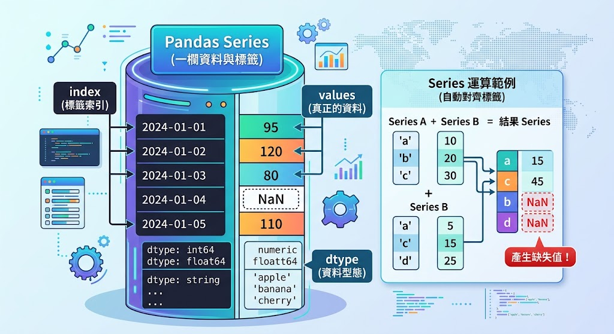

# Pandas：從 CSV 到資料分析

## Series 與 DataFrame

### [Series：有標籤的一欄資料](./pandas_src/Series.py)

Series 可想成 Excel 中一整欄，但每個值都有 index（索引）。

Series 包含三個重要部分：

- values：真正的資料，例如 95、120、80。
- index：每筆資料的標籤。
- dtype：整欄資料型態，例如 `int64`、`float64`、`string`。

為什麼 index 有用？若兩個 Series 做運算，Pandas 會先依標籤對齊，而不只是照位置硬加。這很方便，也可能讓不熟悉者意外產生缺失值。



- [練習：Series](./pandas_problems/Series.ipynb)

### [DataFrame：一張有結構的表格](./pandas_src/dataFrame.py)

DataFrame 是多個欄位共享同一組 index 的二維資料。橫向是 column，縱向是 row。

```python
### 重要屬性：
df.shape       # (列數, 欄數)
df.columns     # 欄名
df.index       # 索引
df.dtypes      # 每欄型態
```

```python
### 容易混淆
menu["價格"]       # Series，一組中括號
menu[["價格"]]     # DataFrame，裡面放欄名清單
# 兩者看起來接近，但形狀不同，能使用的方法與後續合併行為也可能不同。
```

- [練習：DataFrame](./pandas_problems/DataFrame.ipynb)

## [CSV](./pandas_src/CSV.py)

CSV 是純文字，以逗號分隔欄位。優點是簡單、跨系統、容易由程式產生；缺點是沒有工作表、格式、公式、顏色，而且逗號、換行與編碼需正確處理。

```python
# 讀入
df = pd.read_csv("orders.csv", encoding="utf-8")
# 匯出
df.to_csv("clean.csv", index=False, encoding="utf-8-sig")
```

## Excel

Excel `.xlsx` 可有多個 sheet、格式與公式。Pandas 主要讀寫資料值：

```python
# 讀入
df = pd.read_excel("report.xlsx", sheet_name="訂單")
# 匯出
df.to_excel("result.xlsx", sheet_name="清洗後", index=False)
```

- [範例：一次輸出多個工作表](./pandas_src/一次輸出多個工作表.py)
- [練習：CSV&Excel](./pandas_problems/CSV&Excel.ipynb)

## [新增與修改欄位](./pandas_src/新增與修改欄位.ipynb)

## [查看與理解資料](./pandas_src/查看與理解資料.py)

拿到陌生資料最危險的行為，是還沒看清楚就開始清理。固定檢查流程：

```python
df.head()                 # 前 5 列
df.tail()                 # 後 5 列
df.sample(5)              # 隨機抽樣，避免只看開頭
df.shape                  # 列數與欄數
df.columns                # 欄名
df.dtypes                 # 各欄型態
df.info()                 # 型態、非空值、記憶體摘要
df.describe()             # 數值統計
df.describe(include="all")
df.isna().sum()           # 每欄缺失量
df.nunique()              # 每欄不重複值數量
df["類別"].value_counts(dropna=False)
```

## [選取與篩選](./pandas_src/選取與篩選.ipynb)

## [缺失值](./pandas_src/缺失值.ipynb)

## [重複值](./pandas_src/重複值.ipynb)

## [小專題：今天臺灣哪裡空氣比較差](./pandas_src/今天臺灣哪裡空氣比較差.ipynb)

## [小專題：全台YouBike租借站分析](./pandas_src/全台YouBike租借站分析.ipynb)

## [小專題：全臺大專院校科系資料探索](./pandas_src/全臺大專院校科系資料探索.ipynb)

## [排序](./pandas_src/排序.ipynb)

## [分組](./pandas_src/分組.ipynb)

groupby：先分組，再計算

前面學過 sum()、mean()、count()，這些方法可以直接計算整份資料。例如：

```
df["金額"].sum() # 計算所有交易的總金額
```

但實際分析時，我們通常不只想知道「全部花了多少錢？」，更常遇到的是「餐飲花多少？交通花多少？娛樂又花多少？」

groupby() 的概念其實很生活化。假設老師要計算每組學生的平均成績，可以先按照「組別」把學生分桌，再分別計算每桌的平均分數。

用班級生活比喻：`groupby`先依組別把同學分桌，再計算每桌人數或平均成績。

- [範例：基本groupby()](<./pandas_src/基本groupby().py>)

## 從這裡開始

### [as_index=False](./pandas_src/as_index=False.py)

這樣寫：

```py
summary = df.groupby("類別")["金額"].sum()

print(summary)
# 「類別」會出現在 Index：
# 類別
# 交通     145
# 娛樂    1350
# 餐飲     690
```

但很多時候我們希望「類別」繼續是一個普通欄位。這時可以：

```py
summary = (
    df.groupby(
        "類別",
        as_index=False
    )["金額"]
    .sum()
)

print(summary)
#    類別    金額
# 0  交通    145
# 1  娛樂   1350
# 2  餐飲    690
```

## [merge：把散落的表接起來](./pandas_src/merge：把散落的表接起來.py)

訂單表只有店家編號，店家表才有店名。`merge` 就像拿編號當接頭，把兩張表拼起來。

```python
result = orders.merge(shops, on="店家編號", how="left")
```

### [how：決定怎麼合併](./pandas_src/how：決定怎麼合併.py)

merge() 有一個`how`參數，用來決定「如果兩張表的資料沒有完全對得上，要留下哪些資料？」

常見有四種：

| `how`     | 意義                 |
| --------- | -------------------- |
| `"inner"` | 只保留兩邊都有的資料 |
| `"left"`  | 左表全部保留         |
| `"right"` | 右表全部保留         |
| `"outer"` | 左右兩邊全部保留     |
